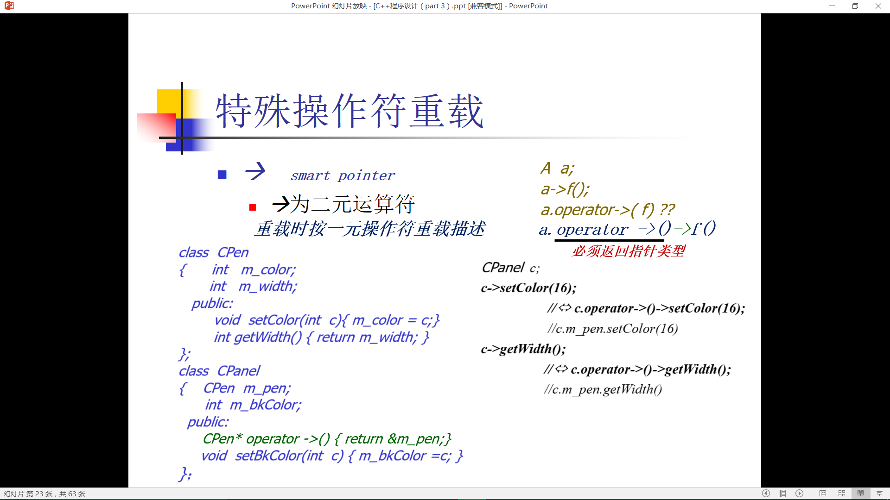

# CPP笔记

### scope

- 程序级
- 文件级
  - 全局变量加static
- 函数级
- 块级

将接口放入.h文件，起到一定的封装作用

### 生命周期

- main中变量有全周期

### namespace

- using-declaration
  - using L::k;
- using-directive
  - using namespace L;

### 预处理

* symbolic constants    *constant*

* open subroutines    *inline*

* generic subroutines    *template*

  * `#denfine max(a,b) (a)>(b)?(a):(b)`
  * `#define mu(a,b) (a)*(b)`

* amazing code

  * `#define Conn(x,y) x##y`
    `#define ToChar(x) #@x`
    `#define ToString(x) #x`

### 数组

* 一维数组的传递，必须显式传递长度
* char数组（字符串）可以不传长度
* ` typedef int T[3]`
  ` 理解为 typedef int[3] T `
* 数组名就是代表所有数据的空间
  * 相当于代表对几亩地的所有权，在传递参数的时候，转换为指针传递，相当于用地契传递


### 指针

* 函数指针
  *  `int (*f)(int i)`
  *  `int *f(int i)`

### 引用

* 返回值是引用或指针时，只返回调用者传递的内容


## OOP

### 成员初始化表

* 按成员变量声明秦顺序
* 如果成员变量有对象，且要使用非默认构造方法初始化对象，只能在成员初始化表初始化，因为构造函数无法显式调用
* const 成员也只能在初始化表
* 顺序先于构造函数
* 成员初始化的顺序取决于它们在类中的声明顺序，与他们在初始化列表中的顺序无关

### 拷贝构造函数 

* 自定义拷贝构造函数调用成员变量默认的构造函数

### 动态对象

* `new delete`
* 堆中建立的对象
* `malloc free` 
  * **不调用**构造和析构函数
* 动态数组的创建
  * 元素对象必须有默认的构造函数

### `const`成员

* 函数不能修改任何变量，除了 mutable变量

### Resource Control

原则： 谁创建， 谁归还
解决方法： 自动归还 

### 友元

* 访问其他类的私有变量，绕过get函数提高效率
* **数据保护**和**数据存取效率**之间的一个折中

### 继承

* 基类构造函数的调用

  * 缺省执行基类**默认构造函数**

  * n 如果要执行基类的非默认构造函数， 则必须在派生类构造函数的**成员初始化表中指出** 

  * ```c++
    class A
    { 
    public: int x;

    A() { x = 0; }

    A(int i) { 
    x = i;
    }
    };
    class B: public A
    {
    public: int y;
    B() { y = 0; }
    B(int i) { y = i; }
    B(int i, int j) : A(i)
    { y = j; }
    ```

    ​


* 将子类赋值给父类，会**丢失**子类派生的属性（不同于java可以重新转换回来）
  * 这里应该用 **指针** 进行操作（或者引用），因为那就只是指针或引用占了个空间，然后对象空间不会被切片。
  * `A *p_a = &b;`
* Early Binding
  * 依据对象类型静态调用
* Late Binding
  * 依据对象**实际类型**动态调用

### 虚函数

* 限制

  * 类的成员函数才可以是虚函数
  * 内联成员函数不能是虚函数
  * 构造函数不能
  * 析构函数往往是虚函数

* 用虚函数表实现

  * 在**对象内存空间**（头部）中含有指向虚函数表的指针
  * 

* 举例

  ```c++
  class A

  {

  public:

  A() { f();}

  virtual void f();

  void g();

  void h() { f(); g(); }

  };

  class B: public A

  { public:

  void f();

  void g();

  };

  B b;  // A::A()， A::f, B::B()

  A *p=&b;

  p->f(); //B::f

  p->g(); //A::g

  p->h(); //A::h, B::f, A::g

  ```

  * 纯虚函数

    * 只给出声明不给实现
    * `virtual display()=0;`

  * 绝对不要重新定义继承而来的缺省参数值

    * 静态绑定
    * 效率 

  * ```c++
    class A
    {
    public:
    virtual void f(int x=0) =0;
    };
    class B: public A
    {
    public:
    virtual void f(int x=1)//改变缺省值
    { cout << x;}
    };
    class C: public A
    {
    public:
    virtual void f(int x) { cout<< x;}
    };
    A *p_a;
    B b;
    p_a = &b;
    p_a->f();/*其中，这里虽然动态调用的是B的f，但是，缺省参数值是静态绑定的，也就是说，它的p_a的类声明是A，所以，缺省参数值是0。但方法调用的是B的f*/
    A *p_a1;
    C c;
    p_a1 = &c;
    p_a1->f();
    ```

### 多继承

* 注意
  * 虚基类的构造函数由最新派生出的类的构造函数调用
  * 虚基类的构造函数优先非虚基类的构造函数执行 

### 私有继承

* 第一个规则：和公有继承相反，如果两个类之间的继承关系为私有，编译器一般**不会将派生类对象转换成基类对象**。
* 第二个规则: 从私有基类继承而来的成员都成为了派生类的私有成员，即使它们在基类中是保护或公有成员
* 私有继承，著名的解释是：implemented-in-terms-of 即派生类是基于这个基类实现的，基类的公有成员、保护成员可以被派生类的**函数**使用；但私有继承的基类对外界（指派生类的用户）是不可见的。因此，有人想到了私有继承的一个著名用途——**让某个类不能当作基类去派生其他类**，即**Java的final关键字**的功能：


### 操作符重载

* 不能重载 `. -> :: `

* 永远不要重载 && 和 ||

  * 失去**短路功能**，引发许多空指针错

* 前++和后++

  * `<ret> operator ++()`
  * `<ret> operator ++(int)`  dummy argument

* 赋值操作符重载不能继承

  * 子类的新成员无法被操作

* 赋值操作可能出现 **自我赋值 **

* object identity

  * same memory location

* `char& operator [](int i) { return p[i]; }`

  `const char operator [] (int i) const { return p[i]; }` 

  * 不允许 `s[i]='D';`

* 类型转换操作符

  * `operator double() { return (double)n/d; } `

* 智能指针重载

* 


### 模板

* 类模板中的静态变量属于实例化的类

### 重定向

* 重新设置 `cin `和 `cout` 的 `buffer`
  * `cin.rdbuf(buf)`

### new 

* new 无法满足内存分配需求时
  * 返回一个空指针
  * 抛出异常
* 先调用指定的new_handler
* `new_handler set_new_handler(new_handler p) throw ()`
  * 接受新的函数指针，返回原来的函数指针
* 在new_handler中最好不要new 对象，可能导致循环错误
* 让更多的内存可被使用
  * 在new_handler中安装一个新的new_handler
  * 卸除掉new_handler
  * 抛`bad_alloc`


### lambda

* example_1

```c++
class CmpInt{
  bool operator()(int a,int b){
    return a<b;
  }
}//重写()

std::sort(items.begin(),items.end(), cmpInt);//函数指针
std::sort(items.begin(),items.end(), CmpInt());//函数对象
std::sort(items.begin(),items.end(),  [](int a,int b){return a<b;});//lambda function
```

#### lambda表达式的语法归纳如下：

`[ caputrue ] ( params ) opt -> ret { body; };`

1).capture是捕获列表；

2).params是参数表；(选填)

3).opt是函数选项；可以填mutable,exception,attribute（选填）

mutable说明lambda表达式体内的代码可以修改被捕获的变量，并且可以访问被捕获的对象的non-const方法。

exception说明lambda表达式是否抛出异常以及何种异常。

attribute用来声明属性。

4).ret是返回值类型。(选填)

5).body是函数体。

另外，**capture** 指定了在可见域范围内 lambda 表达式的代码内可见得外部变量的列表，具体解释如下：

- `[a,&b]` a变量以值的方式捕获，b以引用的方式被捕获。
- `[this]` 以值的方式捕获 this 指针。
- `[&]` 以引用的方式捕获所有的外部自动变量。
- `[=]` 以值的方式捕获所有的外部自动变量。
- `[]` 不捕获外部的任何变量。

#### mutable

　　虽然按值捕获的变量值均补复制一份存储在lambda表达式变量中， 修改他们也并不会真正影响到外部，但我们却仍然无法修改它们。

　　那么如果希望去修改按值捕获的外部变量，需要显示指明lambda表达式为mutable。

　　需要注意：被`mutable`修饰的lambda表达式**就算没有参数也要写明参数列表**。
　　原因：lambda表达式可以说是就地定义仿函数闭包的“语法糖”。它的捕获列表捕获住的任何外部变量，最终均会变为闭包类型的成员变量。按照C++标准，lambda表达式的`operator()`默认是`cons`t的，一个`const`成员函数是无法修改成员变量的值的。而mutable的作用，就在于取消`operator()`的`const`。

```c++
1. int a = 0;  
2. auto f1 = [=] { return a++; };                       //error  
3. auto f2 = [=] () mutable { return a++; };       //OK  
```


### 复习

* Copy Constructor / Copy Assignment

  * ​ 

    ```c++
    Widget w1; // invoke default constructor

    Widget w2(w1); // invoke copy constructor

    w1 = w2; // invoke assignment

    Widget w3 = w2; // invoke copy constructor!

    ```

    ​

* Use ` const`  

  * ```c++
    char *p = greeting;
    const char *p  = greeting;//const data
    char * const p = greeting;//const pointer
    //注意星号的位置
    void f1(const Widge* pw);
    void f2(Widge const *pw);
    //注意const修饰的是什么
    ```


* 下标 [] 操作符重载

  * 需要重载两个版本

  * ```c++
    const char& operator[]() const;//最后的const是为了签名上的区别
    char& operator[]();

    void print(const TextBlock& ctb)
    {
        std::cout << ctb[0]; // OK
        ctb[0] = ‘A’; // Not OK – compiler error
      //这里传过来的是const的 ctb
    }
    TextBlock tb(“hello”);
    tb[0] = ‘H’; // OK because return has &, not const
    s
    ```

* Initialization

  * 6个编译器给出的成员函数
  * 构造函数中不能调用多态函数
    * 多态只有在构造完成后才能使用
    * 原因：构造过程中还不能成为派生类
  * 在**多态中**将基类destructor声明为virtual
    * 否则，子类的析构会失败，剩下碎片
    * 原因在于子类和父类往往不是占用同样大小的空间
  * but don't always make it virtual
    * 无须多态的情况下
  * 不要去继承一个**没有虚函数**的类，如`std::string`或者STL容器
  * prevent exceptions from leaving destructor

* 操作符重载

  * 与等号相关的重载 的 返回值 
    * `*this`
    * 为了链式操作
  * 拷贝构造和拷贝赋值
    * 注意是否拷贝了所有东西
    * 显示调用父类 = 
      * `A::operator=(rhs)`

* ​