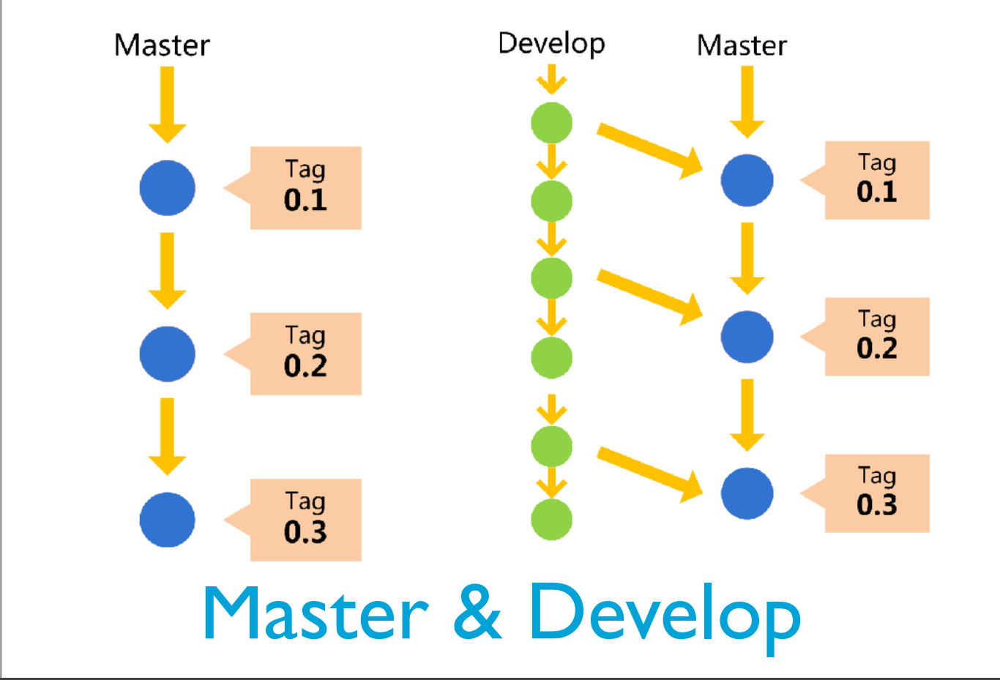
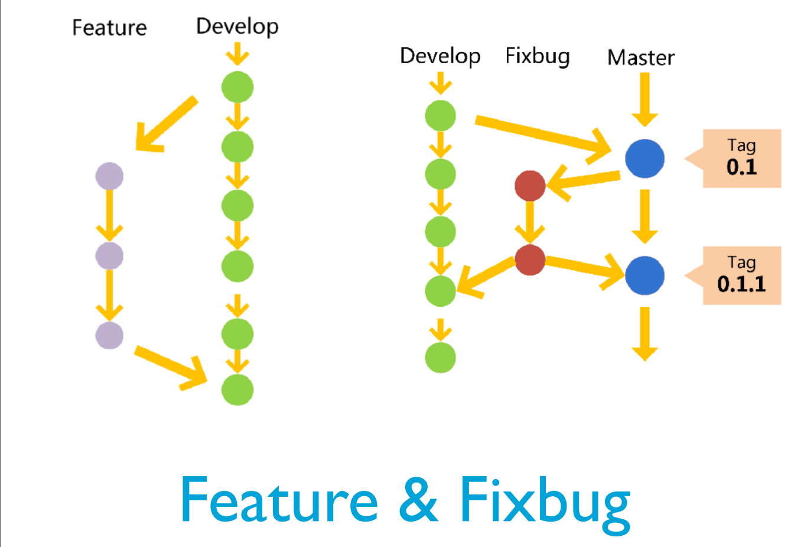

# 软工2复习

### 团队的特征

为了一致的目的、绩效标准、方法而共同承担责任且技能互补的少数人

- 团队成员需要具备共同的目标
- 共同承担责任
- 技能互补
- 团队内部要有一个明确的结构

### 团队结构

- 主程序员
- 民主
- 开放

### 团队建设

- 建立团队章程
- 持续成功
- 和谐沟通
- 避免团队杀手
  - 防范式管理
  - 官僚主义
  - 地理分散
  - 时间分割
  - 产品质量的降低
  - 虚假的最后期限
  - 小圈子控制

### 软件质量

- 质量模型
  - 功能性
  - 可靠性
  - 易用性
  - 效率
  - 可维护性
  - 可移植性
- 质量保障活动
  - 需求开发：需求评审、需求度量
  - 体系结构：体系结构评审、集成测试
  - 详细设计：详细设计评审、设计度量、集成测试
  - 实现：代码评审、代码度量、测试（测试驱动）
  - 测试：测试、测试度量
- 评审（review）
  - 规划阶段 planning
  - 总体部署阶段 overview
  - 准备阶段 preparation
  - 审查会议阶段 inspection meeting
  - 返工阶段 rework
  - 跟踪阶段 follow-up
- 配置管理活动
  - 标识配置项
  - 版本管理
  - 变更控制
  - 配置审计
  - 状态报告
  - 软件发布管理
- 质量度量
  - 测度 和 测量 measure & measurement
    - 定量指标
    - 代码行数
  - 度量 metric

### 配置项管理

- 基线
  - 经过评审的制品，可以作为进一步开发的基础
- 变更控制
  - 提交变更
  - 接受变更请求
  - 变更评估（生成变更表单）
  - 变更决策（变更委员会）
  - 执行变更
  - 验证变更
- 分支管理常见策略
  - 主分支 master
  - 开发分支 develop
  - 临时分支
    - 功能 feature
    - 预发布 release
    - 修补bug  fix bug

### 项目管理的三架马车

- 产品经理
- 项目经理
- 技术经理

### 需求基础

- 需求
  - 就是用户的一种期望，软件系统通过满足用户的期望来解决用户的问题
  - IEEE的定义
    1. 用户为了解决问题或达到某些目标所需要的条件或能力
    2. 系统或系统部件为了满足合同、标准、规范或其他正式文档所规定的要求而需要具备的条件或能力
    3. 对1或2中的一个条件或一种能力的一种文档化表述
- 需求的层次性
  - 业务需求
    - 目标，解决方案与系统特性
  - 用户需求
    - 任务，问题域知识
  - 系统需求
    - 系统行为，需求分析模型

### 需求分析模型

- 用例图
- 概念类图
- 系统顺序图
- 状态图

